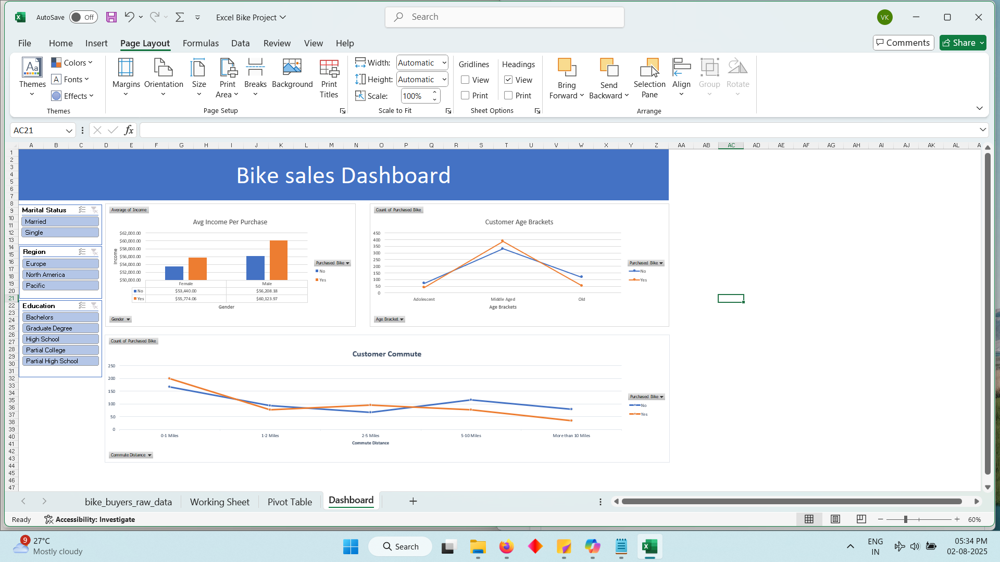

**Excel Bike Project**

This project analyzes customer data related to bike purchases using Microsoft Excel. It includes an interactive dashboard created with pivot tables, charts, and slicers to explore buyer trends.

**Key Insights:**

\- Distribution of purchases based on demographics  

\- Regional patterns in bike buying behavior  

\- Influence of income and age on purchase decisions

**Features:**

\- Interactive Excel dashboard  

\- Visual insights via pivot charts  

\- Clear summary of findings based on provided data

**Tools Used:**

\- Microsoft Excel  

\- Pivot Tables  

\- Slicers and Charts

Bike Sales Dashboard
Here's a quick snapshot of the dashboard built using Excel:

